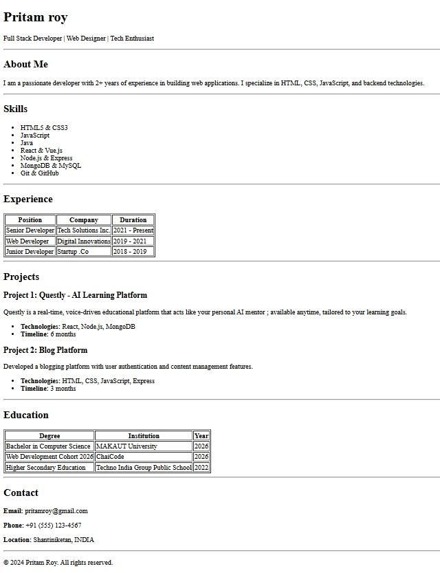

# Single Page Resume Website

A clean and semantic single-page resume website built using pure HTML.  
Designed to showcase profile, skills, experience, projects, education, and contact details in a professional layout.

---

## 🌐 Live Demo

View the deployed project here:  
https://html-eight-peach.vercel.app/

---
### Desktop View

## 📁 Project Structure  
resume-website/ 
├── assests/ 
│ &nbsp; └── preview.png &nbsp;  &nbsp;    # High-resolution preview for README 
├── index.html  &nbsp;  &nbsp;  # Main resume entry point 
└── README.md  &nbsp;  &nbsp;   # Project documentation and setup 

---

## ⚙️ Setup Steps

1. Clone or download this repository.
2. Open the project folder.
3. Open `index.html` directly in your browser.

No build tools.  
No dependencies.  
No installation required.

This is pure HTML.

---

## 🚀 Usage

- Open `index.html` and update:
  - Name
  - About section
  - Skills
  - Experience
  - Projects
  - Education
  - Contact details
